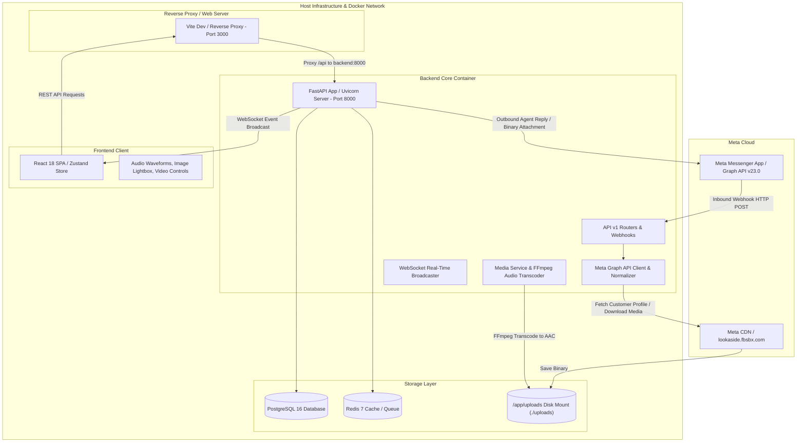
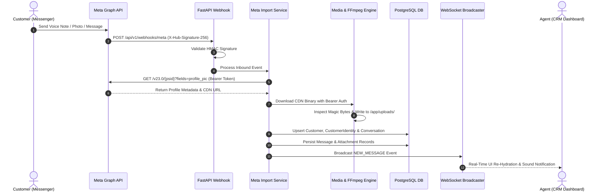
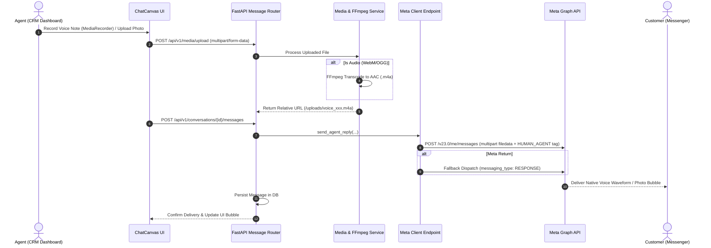
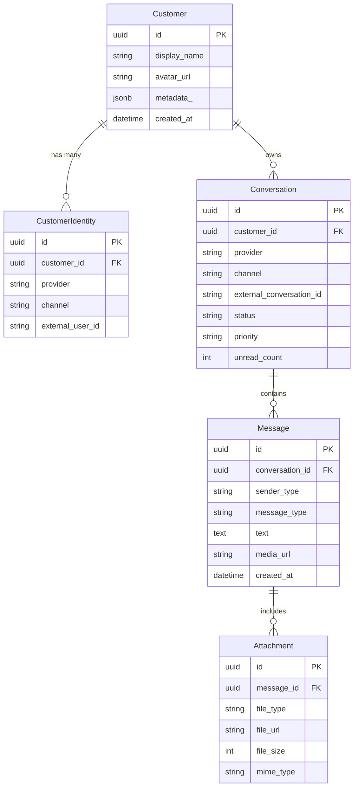

# CRM Omnichannel Platform: Technical Architecture & Meta Integration Guide

## 1. High-Level System Architecture & Component Topology

The CRM Omnichannel Platform is an enterprise-grade messaging and customer relationship management engine designed for real-time bi-directional messaging between Facebook Messenger (Meta Graph API) and agents operating a Web CRM Dashboard.



### Component Roles & Boundaries

1. **Meta Messenger & Graph API v23.0:** Acts as the external customer interface. Sends webhook updates (`messages`, `messaging_postbacks`) and receives agent replies via Graph API endpoints.
2. **Frontend SPA ([App.tsx](file:///home/bishoy/crm-omnichannel/frontend/src/App.tsx)):** Built using React 18, Vite, Tailwind CSS, and Zustand. Connects via HTTP REST (`/api/v1`) and WebSockets (`/ws`) for real-time chat updates.
3. **Backend API Core ([main.py](file:///home/bishoy/crm-omnichannel/backend/app/main.py)):** Built with FastAPI and SQLAlchemy 2.0 (AsyncIO). Manages business logic, schema validation, multi-provider normalization, and database sessions.
4. **Media & Transcoding Pipeline ([media_service.py](file:///home/bishoy/crm-omnichannel/backend/app/services/media_service.py)):** Leverages `ffmpeg` binaries inside the backend container to execute cross-platform audio transcoding (WebM/OGG to AAC/M4A) and binary Magic Byte file inspection.
5. **Persistence Infrastructure:** PostgreSQL 16 stores normalized customer profiles, identity mappings, conversations, messages, and attachments. Host bind mount `./uploads` guarantees zero media loss across container lifecycles.

---

## 2. Meta Graph API Integration Mechanics

### Authentication & Security Controls
- **Page Access Token (`META_PAGE_ACCESS_TOKEN`):** Bearer token authorizing requests to Graph API endpoints (`https://graph.facebook.com/v23.0/`).
- **Webhook Signature Verification (`META_APP_SECRET`):** Incoming `POST /api/v1/webhooks/meta` requests are validated using HMAC-SHA256 signatures passed in `X-Hub-Signature-256`. Payloads failing signature verification are rejected with `HTTP 403 Forbidden`.
- **Authenticated CDN Downloads:** CDN asset URLs returned by Meta (`platform-lookaside.fbsbx.com`, `fbcdn.net`) require the `Authorization: Bearer {META_PAGE_ACCESS_TOKEN}` header to prevent HTTP 403/400 authorization drops during media download.

### Webhook Handshake & Ingestion ([meta_webhook.py](file:///home/bishoy/crm-omnichannel/backend/app/api/v1/meta_webhook.py))
- **Verification (`GET /api/v1/webhooks/meta`):** Evaluates `hub.mode == 'subscribe'` and `hub.verify_token == META_VERIFY_TOKEN`, returning `hub.challenge` string with `HTTP 200 OK`.
- **Event Dispatch (`POST /api/v1/webhooks/meta`):** Extracts entry arrays, checks `messaging` payload items, ignores echo messages (`is_echo: true`), resolves customer identity via Page-Scoped ID (PSID), and triggers normalized database ingestion.

### Outbound Dispatch & Tag Fallback ([client.py](file:///home/bishoy/crm-omnichannel/backend/app/integrations/meta/client.py))
Outbound agent replies support both plain text and native binary attachments:
- **Text Dispatch:** `POST /v23.0/me/messages` with JSON payload `{ recipient: { id: psid }, message: { text: content }, messaging_type: "MESSAGE_TAG", tag: "HUMAN_AGENT" }`.
- **Binary Media Dispatch:** `POST /v23.0/me/messages` using `multipart/form-data`:
  - `recipient`: `{"id": "<PSID>"}`
  - `message`: `{"attachment": {"type": "<image|audio|video>", "payload": {}}}`
  - `filedata`: Attached binary file buffer
- **Tag Error Fallback (#100 Handling):** If Meta returns Error 100 ("Message Tag Required" or "Outside 24-hour Window"), the client automatically retries with `messaging_type: "RESPONSE"` or `UPDATE` to maximize delivery rates.

---

## 3. Comprehensive End-to-End Data Lifecycles

### A. Inbound Lifecycle (Customer Messenger App ➔ CRM Dashboard)



1. **Message Generation:** Customer sends text, voice note, photo, or video on Messenger.
2. **Webhook Intake:** Meta issues `POST /api/v1/webhooks/meta`. FastAPI validates HMAC signature.
3. **Identity Resolution:** Extracts customer PSID. Queries Meta Graph API for customer name and avatar (`profile_pic`).
4. **Media Persistence:** Downloads file bytes using Bearer headers. Identifies file type via Magic Bytes (`\xff\xd8\xff`, `OggS`, `ftyp`). Writes binary to `/app/uploads/`.
5. **Database Transaction:** Ingests record into `Customer`, `CustomerIdentity`, `Conversation`, and `Message` tables using non-destructive UPSERTs.
6. **Real-Time Push:** `WebSocketBroadcaster` emits `NEW_MESSAGE` event payload to subscribed frontend clients. UI hydrates instantly without page reload.

---

### B. Outbound Lifecycle (Agent CRM Dashboard ➔ Customer Messenger App)



1. **Input Capture:** Agent records audio via browser `MediaRecorder` or selects media file.
2. **Media Upload:** `POST /api/v1/media/upload` saves file to `/app/uploads/`.
3. **AAC Audio Transcoding:** If audio is recorded as WebM/Opus, `MediaService` invokes FFmpeg to transcode the binary to native AAC `.m4a` (`-c:a aac -b:a 128k -ar 44100`).
4. **Meta Outbound Dispatch:** `MessageService.send_agent_reply` submits multipart binary payload (`filedata`) with `HUMAN_AGENT` tag to Meta Graph API.
5. **Customer Delivery:** Meta delivers a native playable audio waveform or photo bubble to customer's Messenger app.
6. **Database Persistence:** Confirmed message is written to PostgreSQL and acknowledged to frontend store.

---

## 4. Media Processing & Codec Transcoding Engine

### Cross-Platform Audio Transcoding (FFmpeg Engine)
- **Problem:** Desktop browsers record audio in WebM/Opus (`audio/webm;codecs=opus`). Apple iOS AVFoundation and native iOS Messenger apps cannot decode WebM audio, resulting in `0:00` unplayable broken audio bubbles on iPhones.
- **Solution:** `MediaService.transcode_to_aac` invokes FFmpeg to convert all WebM/OGG audio files into native AAC packaged in M4A containers (`-c:a aac -b:a 128k -ar 44100`).
- **Command:**
  ```bash
  ffmpeg -y -i /app/uploads/raw_audio.webm -c:a aac -b:a 128k -ar 44100 /app/uploads/voice_converted.m4a
  ```

### Binary Magic Bytes Inspection Engine
Meta CDN links frequently strip file extensions (e.g. `image-27780368011591155`). `MediaService` inspects the initial file header bytes to guarantee correct extension assignment:

| Magic Header Bytes | Hex Pattern | Identified Format | Assigned Extension |
| :--- | :--- | :--- | :--- |
| `\xff\xd8\xff` | `FF D8 FF` | JPEG Image | `.jpg` |
| `\x89PNG\r\n\x1a\n` | `89 50 4E 47 0D 0A 1A 0A` | PNG Image | `.png` |
| `RIFF....WEBP` | `52 49 46 46 ... 57 45 42 50` | WebP Image | `.webp` |
| `OggS` | `4F 67 67 53` | Ogg Audio | `.ogg` |
| `....ftyp` | `.. .. .. .. 66 74 79 70` | MP4 Video / M4A Audio | `.mp4` / `.m4a` |

### Partial Content Streaming (HTTP 206)
FastAPI mounts `/uploads` using static file handlers that support HTTP `Range` headers (`Accept-Ranges: bytes`). This enables HTML5 `<audio>` and `<video>` players to stream, seek, and scrub through media files without downloading full binaries upfront.

---

## 5. Data Persistence & Schema Model

### PostgreSQL ORM Entities ([app/models/](file:///home/bishoy/crm-omnichannel/backend/app/models/))



### Docker Volume Isolation & Zero Data-Loss Guarantee
- **Database Storage:** PostgreSQL data persisted to named volume `postgres_data:/var/lib/postgresql/data`.
- **Media Assets:** Uploaded and downloaded files persisted to host bind mount `./uploads:/app/uploads`. Container rebuilds, restarts, or sync operations never wipe user data or cached media binaries.

### Maintenance & Data Repair Utility Pipeline
- [sync_meta_conversations.py](file:///home/bishoy/crm-omnichannel/backend/scripts/sync_meta_conversations.py): Traverses Graph API pagination (`paging.next`) to import missing historical messages.
- [consolidate_all_data.py](file:///home/bishoy/crm-omnichannel/backend/scripts/consolidate_all_data.py): Merges duplicate conversation threads per customer and purges orphaned records.
- [sync_customer_avatars.py](file:///home/bishoy/crm-omnichannel/backend/scripts/sync_customer_avatars.py): Extracts participant PSIDs from conversations and caches profile pictures locally.
- [fix_media_attachments.py](file:///home/bishoy/crm-omnichannel/backend/scripts/fix_media_attachments.py): Repairs missing extensions and links orphaned attachment records to local disk paths.

---

## 6. Frontend Architecture & Universal Media Engine

### Store State Hydration ([useCrmStore.ts](file:///home/bishoy/crm-omnichannel/frontend/src/store/useCrmStore.ts))
- **Multi-Format Extraction:** `fetchConversations` normalizes any backend JSON response wrapper (`Array.isArray(res)`, `res.items`, `res.data`, `res.conversations`).
- **Live Background Polling:** Complements WebSocket updates with a 10-second polling interval in [App.tsx](file:///home/bishoy/crm-omnichannel/frontend/src/App.tsx) to prevent UI desynchronization.

### Universal Media Resolver (`resolveMedia` in [ChatCanvas.tsx](file:///home/bishoy/crm-omnichannel/frontend/src/components/ChatCanvas.tsx))
Evaluates message content, attachments, and metadata to return structured classification (`isAudio`, `isImage`, `isVideo`, `isDoc`, `url`):

```typescript
const resolveMedia = (msg: any): ResolvedMedia => {
  // 1. Inspect explicit attachments array
  // 2. Fall back to media_url and metadata_.attachments
  // 3. Fall back to regex path detection in msg.text (voice_, img_, vid_, /uploads/)
  // 4. Classify media type:
  //    - isImage: .jpg, .png, .webp, .gif, img_ prefix
  //    - isVideo: .mp4, vid_ prefix
  //    - isAudio: .m4a, .ogg, .mp3, voice_ prefix
  //    - isDoc: .pdf, .docx, doc_ prefix
};
```

### Component Rendering Rules
1. **Audio Messages:** Render native interactive waveform player [<CustomAudioPlayer url={media.url} />](file:///home/bishoy/crm-omnichannel/frontend/src/components/ChatCanvas.tsx). Suppresses raw text bubbles and placeholder text.
2. **Image Messages:** Render inline image thumbnail with full-screen Lightbox zoom modal.
3. **Video Messages:** Render HTML5 `<video controls src={media.url} />`.
4. **User Avatars:** [<UserAvatar name={name} avatarUrl={url} />](file:///home/bishoy/crm-omnichannel/frontend/src/components/UserAvatar.tsx) renders local cached JPEG photo or falls back gracefully to a letter avatar.

---

## 7. File Map & Code Responsibility Matrix

| File Path | Core Functions / Exports | Primary Operational Responsibility |
| :--- | :--- | :--- |
| [main.py](file:///home/bishoy/crm-omnichannel/backend/app/main.py) | `FastAPI app`, `/uploads` mount | Application entrypoint, CORS configuration, and static file mount for media streaming. |
| [client.py](file:///home/bishoy/crm-omnichannel/backend/app/integrations/meta/client.py) | `MetaClient`, `send_message` | Direct HTTP client for Meta Graph API v23.0; manages messaging dispatch and tag fallback. |
| [provider.py](file:///home/bishoy/crm-omnichannel/backend/app/integrations/meta/provider.py) | `MetaProvider` | Adapter pattern wrapping `MetaClient` to implement provider-agnostic messaging interfaces. |
| [meta_import_service.py](file:///home/bishoy/crm-omnichannel/backend/app/services/meta_import_service.py) | `MetaImportService` | Manages historical sync, profile pic caching, and multi-page message normalization. |
| [message_service.py](file:///home/bishoy/crm-omnichannel/backend/app/services/message_service.py) | `MessageService.send_agent_reply` | Handles outbound message business logic, media dispatch, and database persistence. |
| [media_service.py](file:///home/bishoy/crm-omnichannel/backend/app/services/media_service.py) | `MediaService`, `transcode_to_aac` | Executes FFmpeg audio transcoding to AAC/M4A and Magic Byte binary file identification. |
| [conversation_service.py](file:///home/bishoy/crm-omnichannel/backend/app/services/conversation_service.py) | `ConversationService.list_conversations` | Provides null-safe queries for paginated inbox threads and customer relationships. |
| [conversations.py](file:///home/bishoy/crm-omnichannel/backend/app/api/v1/conversations.py) | REST API Endpoints | Handles `/conversations`, `/messages`, status updates, agent assignment, and priority tags. |
| [meta_webhook.py](file:///home/bishoy/crm-omnichannel/backend/app/api/v1/meta_webhook.py) | `verify_webhook`, `receive_webhook` | Ingests Meta webhooks, validates HMAC signatures, and triggers real-time message processing. |
| [useCrmStore.ts](file:///home/bishoy/crm-omnichannel/frontend/src/store/useCrmStore.ts) | `useCrmStore` (Zustand) | Global state management for conversations, messages, active filters, and WebSocket events. |
| [api.ts](file:///home/bishoy/crm-omnichannel/frontend/src/services/api.ts) | `apiService`, `safeFetch` | HTTP client wrapper providing relative proxy routing with direct port fallback. |
| [ChatCanvas.tsx](file:///home/bishoy/crm-omnichannel/frontend/src/components/ChatCanvas.tsx) | `ChatCanvas`, `resolveMedia` | Active chat stream panel rendering audio waveforms, lightbox images, and video controls. |
| [ConversationList.tsx](file:///home/bishoy/crm-omnichannel/frontend/src/components/ConversationList.tsx) | `ConversationList` | Inbox sidebar thread queue with brand filter bypass and search filtering. |
| [UserAvatar.tsx](file:///home/bishoy/crm-omnichannel/frontend/src/components/UserAvatar.tsx) | `UserAvatar` | Customer profile avatar component with image error handling and letter fallback. |
| [docker-compose.yml](file:///home/bishoy/crm-omnichannel/docker-compose.yml) | Service definitions | Multi-container orchestration for FastAPI, React, PostgreSQL, Redis, and Ngrok. |
