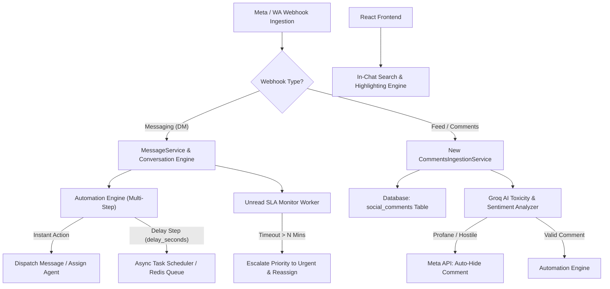

# SYSTEM_CAPABILITIES_AUDIT_REPORT.md — Forensic Audit of System Capabilities

## 1. Executive Summary & Diagnostic Matrix

A comprehensive read-only forensic audit was performed across backend models, PostgreSQL database schemas, Meta Graph API integration services, automation engines, and React frontend components to evaluate current CRM capabilities against 5 new client requirements.

### System Capabilities Matrix

| Requirement Area | Current Status | Database Schema State | Integration & Engine State | Frontend UI State |
|---|---|---|---|---|
| **1. Comments & Meta Feed Webhooks** | ❌ **Missing** | No `comments` or `social_comments` tables | Webhooks only handle `entry[].messaging` & WhatsApp `messages`; `entry[].changes` (feed/comments) unhandled | No Comments feed tab or post moderation UI |
| **2. Comment Auto-Moderation & Sentiment** | ⚠️ **Partial** | No moderation rule models | Groq AI Copilot analyzes sentiment/intent for chat; no automated toxicity filter or comment hide/delete hook | No moderation action controls |
| **3. Automations & Delay Timers** | ⚠️ **Partial** | `automation_rules` & `automation_execution_logs` exist | Synchronous keyword matcher (`AutomationService`); no step timers (`delay_seconds`) or multi-action workflows | `AutomationsManager.tsx` manages simple keyword rules |
| **4. Inbound Routing & Escalation** | ⚠️ **Partial** | `conversations` has `unread_count`, `sla_due_at`, `priority` | `MessageService` updates `unread_count` & `last_activity_at`; lacks unread escalation workers & fallback routing | `ConversationList` displays unread badges & SLA tags |
| **5. In-Chat Message Search & Highlighting** | ⚠️ **Partial** | Messages table supports SQL text filtering | API supports conversation listing search; no in-chat message content search query endpoint | `ConversationList` searches conversation names/previews; `ChatCanvas` has **0** in-chat search & **0** highlight |

---

## 2. Requirement-by-Requirement Forensic Findings

### Requirement 1: Comments Management & Meta Feed Webhooks
- **Database**:
  - Existing tables: `conversations`, `messages`, `customer_identities`, `customers`, `automation_rules`, `raw_events`.
  - Missing tables: `comments`, `post_comments`, `social_posts`.
- **Backend Webhook Services (`backend/app/services/meta_import_service.py`)**:
  - `MetaImportService.process_inbound_webhook` currently processes messaging objects (`entry[].messaging[]` for Messenger/Instagram DM and `entry[].changes[].value.messages[]` for WhatsApp Cloud API).
  - Webhooks for Meta Page/Instagram Post Feed comments (`entry[].changes[]` where `field == "feed"` or `field == "comments"`) are currently **unprocessed**.
  - Meta API Client (`app/integrations/meta.py`) lacks graph endpoints for comment interactions:
    - `POST /{comment_id}/comments` (Reply to comment)
    - `POST /{comment_id}?is_hidden=true` (Hide comment)
    - `DELETE /{comment_id}` (Delete comment)
- **Frontend UI (`frontend/src/components/`)**:
  - `ChatCanvas.tsx` is exclusively wired to direct message threads (`messages` table).
  - No tab or view exists for managing social media post comments or post previews.

---

### Requirement 2: Comment Auto-Moderation & AI Sentiment
- **Current Sentiment Infrastructure (`backend/app/services/llm/`)**:
  - `GroqCascadeService` and `prompts.py` (`COPILOT_SYSTEM_PROMPT`) analyze sentiment (`إيجابي`, `محايد`, `سلبي`, `غاضب`), intent, and customer location for direct chat messages.
- **Missing Moderation Pipeline**:
  - No database model for sentiment thresholds or banned profanity/toxicity lists.
  - No automatic webhook hook to evaluate incoming public comments against Groq AI toxicity classifiers and execute instant auto-hide (`is_hidden=true`) or auto-reply.

---

### Requirement 3: Automation Actions & Delay Timers
- **Current Automation Engine (`backend/app/models/automation.py` & `automation_service.py`)**:
  - Table `automation_rules`: Supports `name`, `keywords` (JSONB list), `match_type` (`contains`, `exact`, `regex`), `response_text`, `response_media_url`, `cooldown_minutes`, `is_active`.
  - Execution Engine (`AutomationService.evaluate_inbound_message`): Runs synchronously inside `MessageService.create_message` during message ingestion. If a keyword matches, it returns a single instant reply.
- **Architectural Gaps for Multi-Step Workflows**:
  - Does NOT support independent step delays (`delay_seconds`).
  - Does NOT support sequential action pipelines (e.g., Action 1: Send reply -> Delay 60s -> Action 2: Assign agent -> Action 3: Add tag).
  - Lacks an asynchronous task scheduler/queue (e.g., Celery / BackgroundTasks / asyncio loop worker) to handle delayed action execution.

---

### Requirement 4: Inbound Unmatched Routing & Unread Escalation
- **Inbound Message Flow**:
  - `MessageService.create_message` updates `last_message_at`, `last_activity_at`, and increments `unread_count`.
  - WebSocket `NEW_MESSAGE` event broadcasts to connected frontend clients.
- **Routing & Escalation Gaps**:
  - Unmatched conversations remain with `assigned_agent_id = null`.
  - No automated round-robin or skill-based auto-assignment engine.
  - No background SLA escalation worker to monitor unread conversations and automatically upgrade `priority` (e.g., `normal` -> `high` -> `urgent`) after $N$ minutes of unread inactivity.

---

### Requirement 5: In-Chat Message Search & Highlighting
- **Frontend Search (`frontend/src/store/useCrmStore.ts` & `ConversationList.tsx`)**:
  - `searchQuery` filters the conversation sidebar list by matching against `customer_display_name`, `last_message_text`, or `external_conversation_id`.
- **In-Chat Search Gaps (`frontend/src/components/ChatCanvas.tsx`)**:
  - `ChatCanvas.tsx` has **0** in-chat search input.
  - No message filtering or scroll-to-matched-message behavior within the active conversation canvas.
  - No text highlighting (e.g., `<mark class="bg-amber-200">`) for matching search terms within message bubbles.

---

## 3. Recommended Architectural Blueprint (Read-Only Roadmap)

To fulfill all 5 client requirements cleanly without breaking existing 80/80 passing tests:

### Proposed Schema Additions
1. **`social_comments` Table**: Store post ID, comment ID, author ID/name, comment text, sentiment, moderation status (`visible`, `hidden`, `deleted`), and reply text.
2. **`automation_rules` Table Expansion**: Extend to support an array of `actions` (JSONB) containing step types (`send_reply`, `assign_agent`, `add_tag`, `set_priority`, `delay`), with `delay_seconds` per action.

---

## 4. Diagnostic Conclusion

The system has a solid architectural foundation (PostgreSQL, SQLAlchemy Async, FastAPI, Groq AI, WebSockets, Zustand). All 5 new client requirements can be cleanly integrated via modular backend extensions and frontend component additions with **zero impact** on existing functionality.
